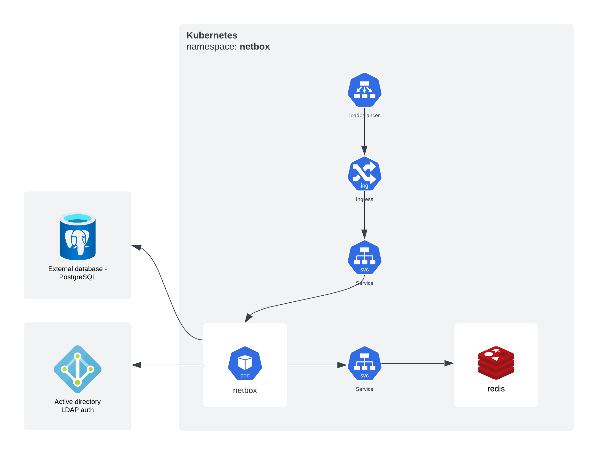

# k8s-netbox
A solution to deploy a Netbox environment on a Kubernetes cluster.

### About PostgreSQL database
This deploy do not create a PostgreSQL database so you need to deploy a database separately.


### Usage
Clone this repo
```bash
$ git clone https://github.com/ambrisolla/k8s-netbox.git
```

#### About LDAP Authentication
A simple configuration was created to provided LDAP authentication. Change netbox-configmap.yml to put your own information about authentication. LDAP bind password needs to be changed in netbox-secrets.yml file:
```yaml
  # Settings to LDAP auth
  LDAP_SERVER: "brisa.io"
  LDAP_DN: "DC=brisa,DC=io"
  LDAP_BIND_DN: "CN=admin,DC=brisa,DC=io"
```

Edit netbox-secret.yml with your own passwords:
```yaml
apiVersion: v1
data:
  LDAP_BIND_PASSWORD: aGV5d2hhdHN1cA== # ldap bind password
  SUPERUSER_PASSWORD: aGV5d2hhdHN1cA== # netbox admin password 
  DB_PASSWORD: aGV5d2hhdHN1cA==        # database password
kind: Secret
metadata:
  name: netbox
  namespace: netbox
```

Change host value in netbox-ingress.yml:
```yml
spec:
  ingressClassName: nginx
  rules:
  - host: "muzel.io" ## change here with your own domain
    http:
      paths:
      - backend:
```

Create a namespace called "netbox":
```bash
$ kubectl create ns netbox
```

Apply Kubernetes resource configurarion:
```bash
$ kubectl apply -f .
```

### Architecture
